  <h1><a id="intro">geminishkv</a><kbd>AppSec Team Lead</kbd></h1>

<!-- COMMIT-BADGES-START -->

<!-- COMMIT-BADGES-END -->

Salute :wave:

I'm Elijah Shmakov, Information Security Officer and Application Security Team Lead. MA degree at BMSTU.
Official website: **[geminishkv.tech](https://geminishkv.tech)**.
Participated in securing products for BI, E-commerce, Supply Chain, Cryptocurrency, and Mobile GameDev. Active participant in InfoSec conferences and forums.

I build and scale Application Security and DevSecOps practices for fintech, integrators and high‑load platforms – from zero to production‑ready services. Design and implement code supply security services, as well as AppSec Toolchain mechanisms.

***

### **My focus on**

* Secure SDLC & DevSecOps: Shift‑Left, automation of AppSec practices for web, mobile, APIs and microservices
* Secure architecture review (web, mobile, APIs, microservices), security design for payment and crypto systems
* Risk‑based security: risk assessment, vulnerability management, threat modeling
* Supply‑chain security: SBOM, artifact signing, dependency and container hygiene

***

### **Professional summary**

* Leader with end‑to‑end experience building application security functions from scratch in enterprise and fintech environments (banking, crypto)
* Designs and implements Secure SDLC: integrating SAST, SCA, DAST, container and secrets scanning into CI/CD, driving Security Champions programs and risk‑based remediation
* Strong background in information security risk management and compliance (PCI DSS, critical infrastructure regulations, fintech standards), with proven ability to balance security and time‑to‑market

| | |
| --- | --- |
| **Location** | Moscow, Russia — open to relocation and business trips |
| **Target roles** | DevSecOps Team Lead · AppSec Team Lead · Head of IS · CTO |
| **Employment** | Full‑time or contract, hybrid or remote |
| **Languages** | Russian (native) · English (Intermediate) |

***

### Experience

<!-- EXPERIENCE-START -->
| Period | Company | Role |
| --- | --- | --- |
| Aug 2026 — present | [SberSpasibo](https://spasibosberbank.ru) | AppSec Team Lead |
| Dec 2024 — Jul 2026 | [LANIT](https://lanit.ru) | AppSec Team Lead |
| Jun 2022 — Dec 2024 | [Rosbank](https://www.rosbank.ru) / [TBank](https://www.tbank.ru) | Deputy Head of IS Risk Department |
| Jan 2022 — Jul 2022 | [EMCD Tech](https://emcd.io) | Chief Information Security Officer |
| Dec 2020 — Aug 2021 | [SUNLIGHT](https://sunlight.net) | Deputy Director of Information Security |
| Jan 2020 — Dec 2020 | [Poly Play Inc](https://alfabravo.us/) | Senior IS Specialist (Lead) |
| Apr 2019 — Jan 2020 | [Weter IT](https://weter.denistia.ru/ru/) | Senior IS Specialist |
<!-- EXPERIENCE-END -->

***

### Achievements

* Received a letter of appreciation from V. Selin for my substantial contribution to application security SAST activities in the FSTEC of Russia certification process under GOST 71207
* Founder and lead of the [**FinDevSecOps**](https://findevsecops.ru) community for the Russian fintech market
* Organiser of the first DevSecOps hackathon in Russia and continuing the series in 2026
* Lecturer in secure software development and information security at leading technical universities:
  * Bauman Moscow State Technical University (BMSTU)
  * Moscow Institute of Physics and Technology (MIPT)
* Author of articles and talks on DevSecOps, secure development, and practical AppSec

***

### Open-Source projects

<!-- PROJECTS-START -->
| Project | Description | Stack |
| --- | --- | --- |
| [oss_toolchainmap](https://github.com/geminishkv/oss_toolchainmap) | AppSec tools map — helps choose the optimal solution for any situation: no budget, no integration resources, no team. | Python |
| [course_labs](https://github.com/geminishkv/course_labs) | Lab exercises for AppSec, Risk Analysis, Security Champion courses: Toolchain, Orchestration, CI/CD, UML and more. | Python |
| [sbom_genform](https://github.com/geminishkv/sbom_genform) | CLI tool for generating and formatting SBOM (CycloneDX / SPDX) with CI/CD pipeline integration. | Python |
| [semgrep_java_custom_ruleset](https://github.com/geminishkv/semgrep_java_custom_ruleset) | Custom Semgrep rules for Java based on OWASP TOP 10, wrapped in a Makefile for standalone execution. | Shell |
| [geoip-tool](https://github.com/geminishkv/geoip-tool) | GeoIP-lookup mini-utility from the terminal and a Burp Suite plugin. Works via curl + jq without API keys. | Shell |
<!-- PROJECTS-END -->

Packages: [GitHub](https://github.com/geminishkv?tab=packages) · [Docker Hub](https://hub.docker.com/u/geminishkvdev) · [PyPI](https://pypi.org/user/geminishkv)

***

### AppSec Toolchain

<!-- TOOLCHAIN-START -->
| Area | Tools |
| --- | --- |
| SAST | Semgrep · SonarQube · Checkov · Bandit · BlackDuck |
| SCA | Dependency-Check · Trivy · Syft · Grype · Clair |
| DAST | AutoSwagger · Nuclei · Burp Suite · Checkmarx · Acunetix |
| Secrets | HashiCorp Vault · Gitleaks · Bitwarden · Keycloak · OPA |
| Container | Trivy · Harbor · Cosign · Cilium · Falco |
| Mobile | MobSF · APKTool · Frida · Objection · QARK |
| SBOM | cdxgen · RetireJS · Syft · Sonatype |
| DevOps | Docker · GitLab CI/CD · Jenkins · Helm · Kubernetes |
<!-- TOOLCHAIN-END -->

***

### Content & talks

> * Podcast about secure development on [Podster](https://podster.fm/podcasts/bezopasnyyvykhod/e/375805/bezopasnaya-razrabotka-devsecops) and [YouTube](https://www.youtube.com/watch?v=LifFzjdvGTc)
> * Interview with the BISA association on [YouTube](https://youtu.be/sPGhWWaWUdE) about secure software development
> * Organized the first DevSecOps [hackathon in Russia](https://t.me/fintechassociation/6261) and [how it went](https://t.me/shmakovis_appsec/16)
> * [AppSec course](https://course.geminishkv.tech/) and [DevSecOps course at MIPT](https://kiberbez-tech.ru)
> * [Security Champion training](https://inseca.tech/security-champion-training)
> * Open-source [AppSec Toolchain map](https://findevsecops.github.io/oss_toolchainmap/pdf_table/tools-map.pdf) built in the [FinDevSecOps](https://findevsecops.ru) community, with a focus on import‑substitution solutions
> * [Reference secure development process for fintech](https://storage.yandexcloud.net/aft-tilda/%D0%A2%D0%B8%D0%BF%D0%BE%D0%B2%D0%BE%D0%B9%20%D0%BF%D1%80%D0%BE%D1%86%D0%B5%D1%81%D1%81%20%D0%B1%D0%B5%D0%B7%D0%BE%D0%BF%D0%B0%D1%81%D0%BD%D0%BE%D0%B9%20%D1%80%D0%B0%D0%B7%D1%80%D0%B0%D0%B1%D0%BE%D1%82%D0%BA%D0%B8%20%D0%B4%D0%BB%D1%8F%20%D1%84%D0%B8%D0%BD%D1%82%D0%B5%D1%85%D0%B0.pdf) (GOST R 56939‑2024)

***

## How I can help?

* Design and roll out DevSecOps processes
* Build AppSec Toolchain with focus on developer experience
* Run threat modeling, risk analysis and security workshops for teams

***

### Where to find me?

* Website: [geminishkv.tech](https://geminishkv.tech) · [blog](https://geminishkv.tech/blog/)
* Telegram: [@geminishkv](https://t.me/geminishkv)
* Blog (ru): [AppSecTA](https://t.me/shmakovis_appsec)
* Email: [shmakovis@inbox.ru](mailto:shmakovis@inbox.ru)
* LinkedIn: [geminishkvdev](https://www.linkedin.com/in/geminishkvdev/)

> ### Disclaimer
>
> All information in this profile and the included repositories (according to GitHub’s applicable terminology), including any text and graphic works, is provided for informational purposes only.
> Any use of the information provided through this profile and/or any text or graphic works in the repositories in practice, without prior consent from the subject for conducting testing, falls under the scope of applicable law.
> The author is not responsible for any possible damage caused by the provided materials, including any text or graphic works.
> All text and graphic works, including links, are for informational purposes only and are intended solely to share knowledge in product security.

---

<!-- CERTS-START -->

---

### Certificates

| ContentId | Area | PageTitle | MetaDescription |
| --- | --- | --- | --- |
| UC-SPEC | Training Center "Specialist", BMSTU | Team Lead in Software Development | Comprehensive program on building and leading software development teams, including planning, delegation, communication, conflict resolution, and performance management in IT projects |
| UC-SPEC-DEVOPS | Training Center "Specialist", BMSTU | DevOps Engineer | Intensive course on DevOps engineering covering CI/CD pipelines, infrastructure as code, containerization, monitoring, and collaboration between development and operations teams |
| UC-SPEC-DASA-DEVOPS-PO | Training Center "Specialist", BMSTU | DASA DevOps Product Owner | Certification program focused on the role of a DevOps Product Owner, value delivery, backlog management, stakeholder communication, and aligning business goals with DevOps practices |
| UC-SPEC-DEVOPS-PRO | Training Center "Specialist", BMSTU | Certificate DevOps Professional | Advanced DevOps professional training covering end-to-end delivery automation, environment management, reliability engineering, and scaling DevOps practices across teams |
| UC-SPEC-AGILE-SCRUM | Training Center "Specialist", BMSTU | Agile - Scrum Management | Course on managing development processes using Agile and Scrum, including roles, ceremonies, artefacts, iterative planning, and continuous improvement in software teams |
| UC-SPEC-SCRUM-MASTER | Training Center "Specialist", BMSTU | Scrum Master | Practical training for Scrum Masters on facilitating teams, removing impediments, coaching stakeholders, and ensuring effective use of Scrum in projects |
| UC-SPEC-SOFT-TEST | Training Center "Specialist", BMSTU | Certificate Software Testing as QA Specialist | Fundamental and advanced software testing course covering test design techniques, test documentation, functional and non-functional testing, defect management, and QA processes |
| UC-SPEC-DASA-DEVOPS-PRACT | Training Center "Specialist", BMSTU | DASA: DevOps Practitioner for Team Organization | Hands-on DASA DevOps Practitioner program focused on team organization, culture change, collaboration patterns, and practical implementation of DevOps principles in organizations |
| UC-SPEC-QA-PROJECTS | Training Center "Specialist", BMSTU | Quality Management in Projects and Services | Course on designing and implementing quality management systems for IT projects and services, including metrics, processes, audits, and continuous improvement practices |
| UC-SPEC-NET-ADMIN | Training Center "Specialist", BMSTU | Administration of Services and Networks | Training on administration of network services and infrastructures, including configuration, troubleshooting, access control, monitoring, and ensuring availability in enterprise environments |
| UC-SPEC-SEC-SYSTEMS | Training Center "Specialist", BMSTU | DevOps: Security of Systems, Services, and Networks | Course on integrating information security into systems, services, and network operations, covering threats, secure configuration, hardening, and DevSecOps security controls |
| UC-SPEC-ZABBIX | Training Center "Specialist", BMSTU | Zabbix. Monitoring of Enterprise IT Infrastructure | Practical course on deploying and using Zabbix for enterprise IT infrastructure monitoring, including metrics collection, alerting, dashboards, and capacity planning |
| UC-SPEC-CLUSTERS | Training Center "Specialist", BMSTU | Building Fault-Tolerant Cluster Solutions | Training on designing and implementing fault-tolerant cluster solutions with high availability, load balancing, redundancy, and disaster recovery strategies |
| UC-SPEC-AZURE | Training Center "Specialist", BMSTU | Azure Introduction | Introductory course on Microsoft Azure covering core cloud concepts, basic services, resource management, and foundational skills for working with Azure environments |
| CYBERED-OWASP | CyberED | Web Application Security and Threat Detection Practice Based on OWASP TOP 10 | Hands-on course in web application security focused on OWASP Top 10 risks, practical exploitation, detection techniques, and mitigation strategies for modern web apps |
| KASP-IS-ENTERPRISE | Kaspersky Academy | Enterprise Information Security | Program on building and managing enterprise information security, including risk assessment, policies, controls, incident response, and regulatory compliance |
| INFOSEC-WEB | Informzashita | Web Application Security | Practical training in web application security testing, covering common vulnerabilities, secure coding principles, and approaches to protecting web services |
| OTUS-DEVSECOPS | Otus | Implementation and Work in DevSecOps | Deep-dive course on implementing DevSecOps in organizations, integrating security into CI/CD, automating checks, and aligning development, operations, and security teams |

<!-- CERTS-END -->
